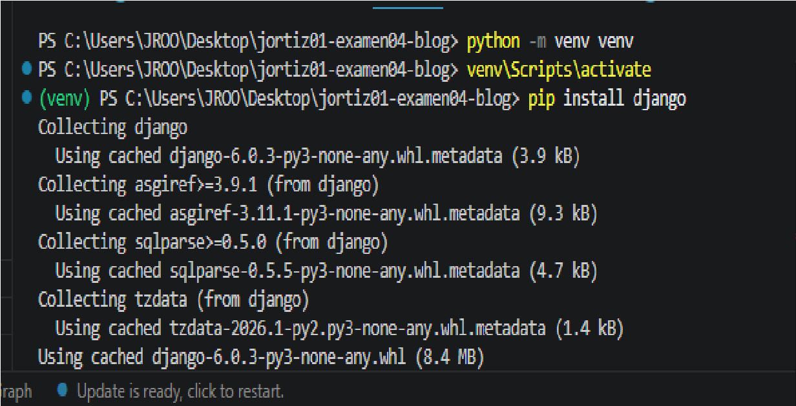
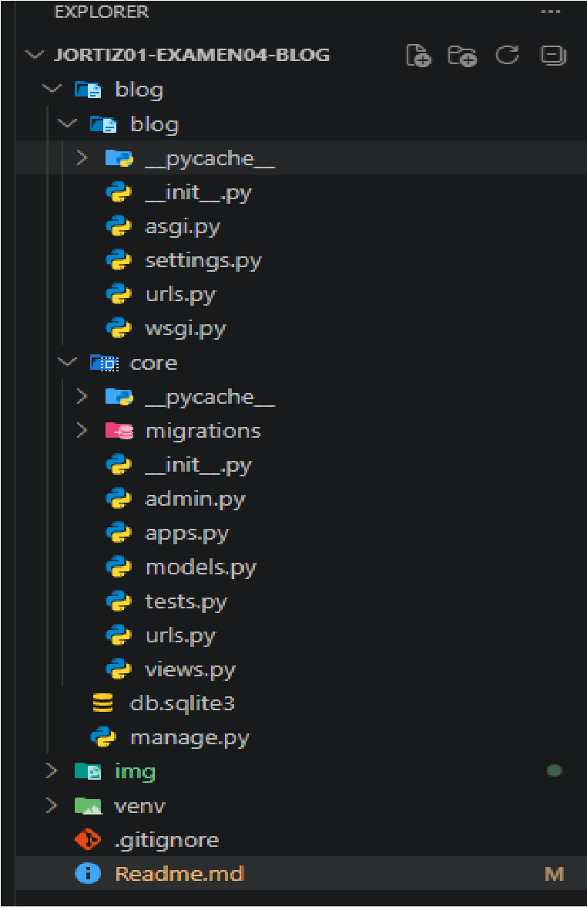
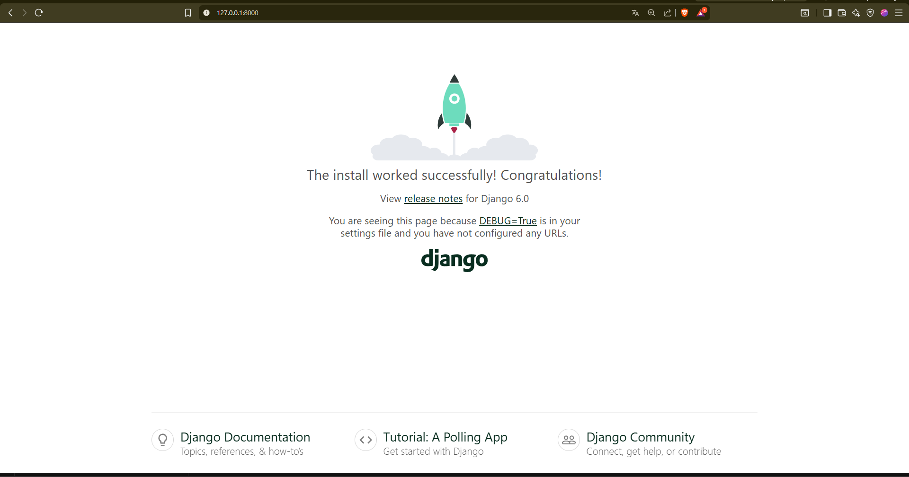
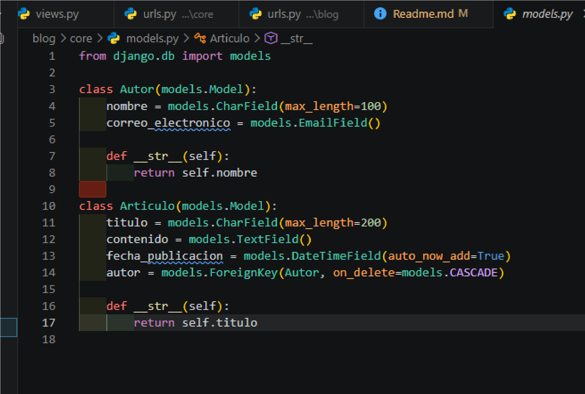
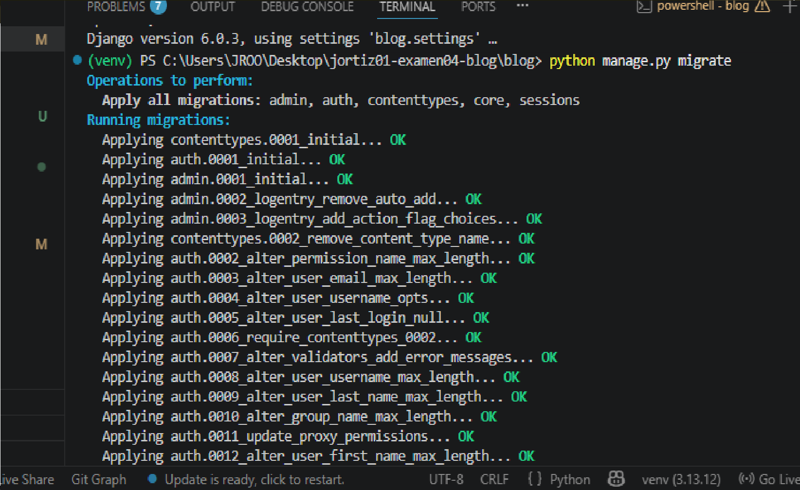
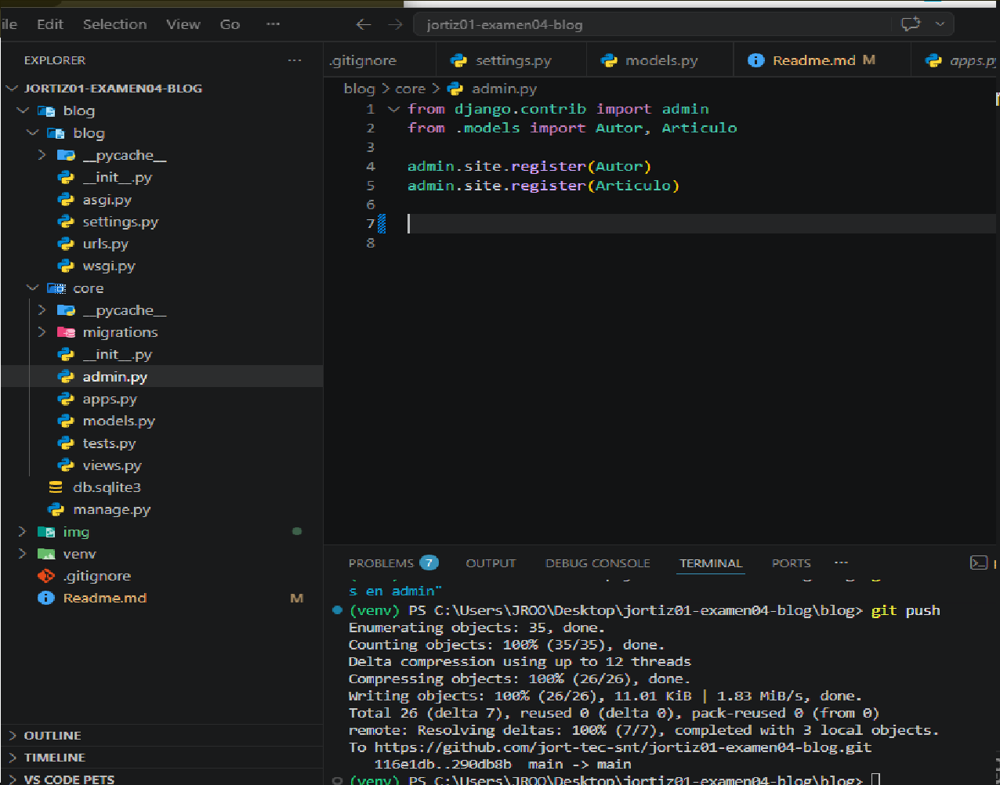
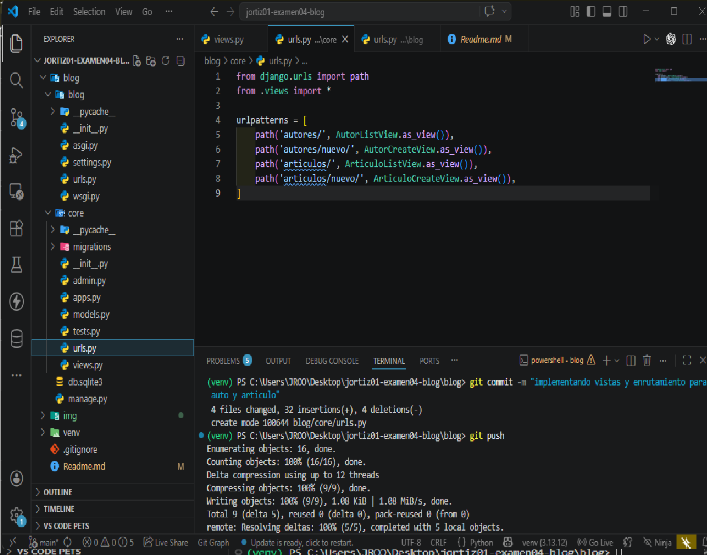
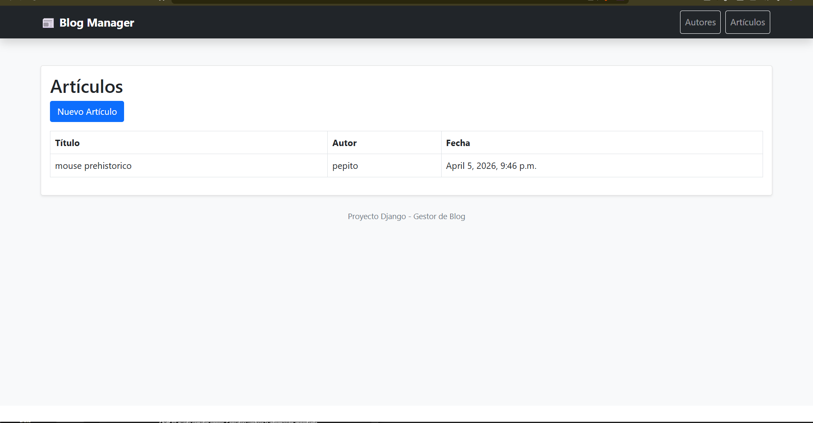
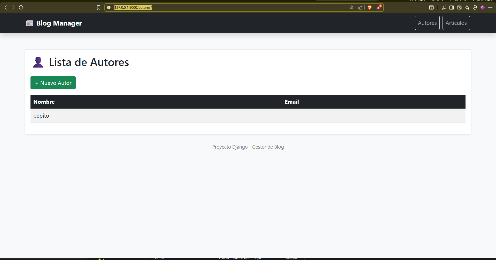

## Iniciando Proyecto

## Estructura del Proyecto

## Servidor Corriendo

## Creando el modelo

## Realizando migraciones

## Activando Admin desde el modelo

## Implementando Vistas y Enrutamientos para autor y articulo

## Corriendo  vista Articulos

## Corriendo Autores

